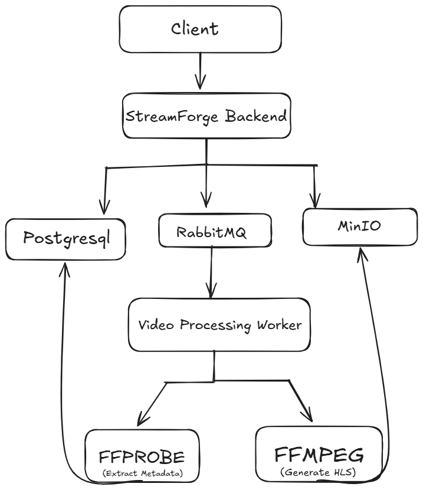
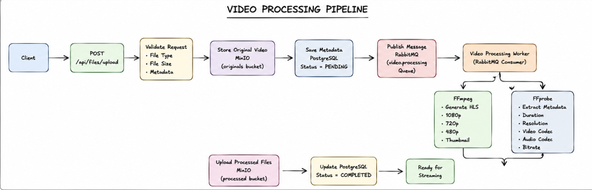
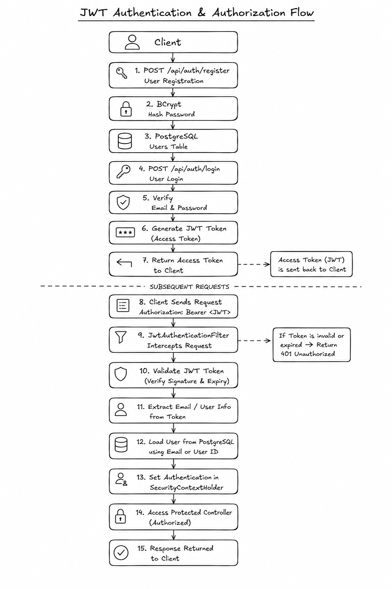
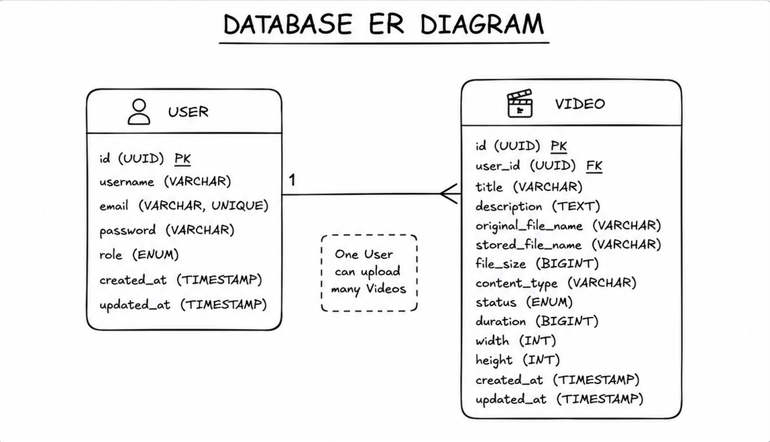
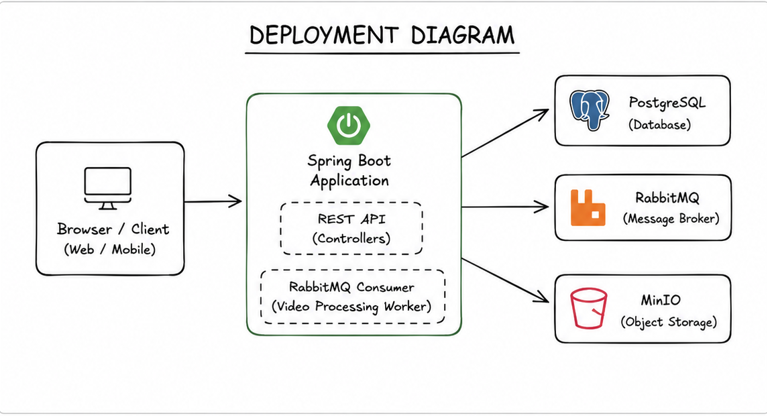
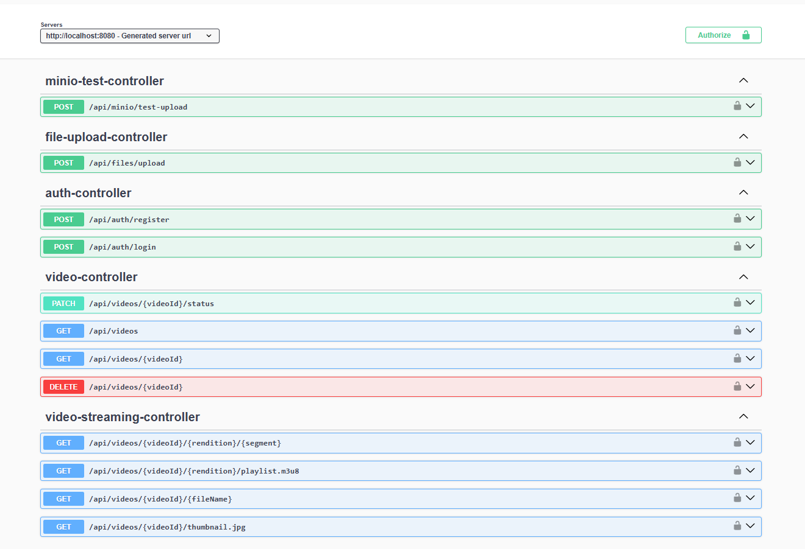
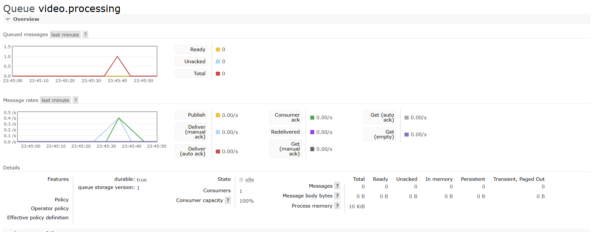
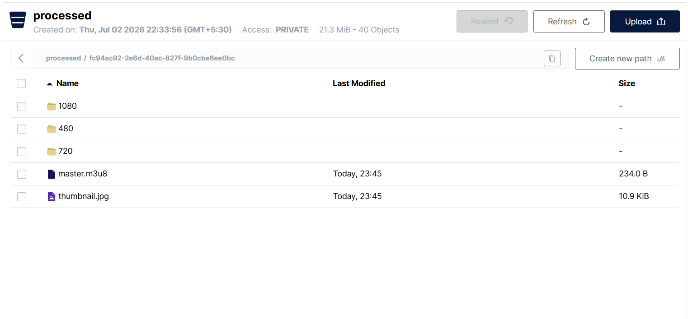
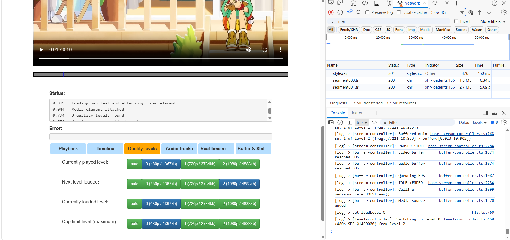
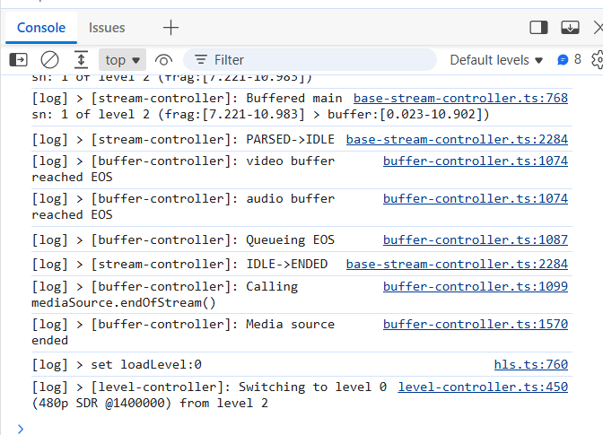

# StreamForge

StreamForge is designed to handle video ingestion and streaming. Instead of
performing resource-intensive video transcoding synchronously within the HTTP
request thread, the application decouples the upload lifecycle from the
processing pipeline using an asynchronous message-driven architecture.

When a client uploads a video, the request is received by the Spring Boot API,
which writes the original raw video file to a MinIO object storage bucket and
saves the initial video metadata to a PostgreSQL database. The API then
publishes a message to a RabbitMQ queue and returns a success response with
the video ID.

A background consumer process listens to the queue, downloads the original
video, executes FFmpeg to perform multi-resolution HLS transcoding, invokes
FFprobe to analyze stream metadata, uploads the final HLS segments and
thumbnail back to MinIO, and updates the database record with the new status
and video properties.

## System Architecture

The following diagram shows the overall architecture of StreamForge.

<p align="center">
  
</p>

## Video Processing Pipeline

The following diagram illustrates how an uploaded video moves through the processing pipeline.

<p align="center">
  
</p>

## Authentication & Authorization

The following diagram shows the authentication and authorization flow.

<p align="center">
  
</p>

## Database Design

The following diagram represents the relationship between the application's core entities.

<p align="center">
  
</p>

## Deployment Architecture

The following diagram illustrates how the application and supporting services are deployed.

<p align="center">
  
</p>

## Project Structure

```
StreamForge
├── docs/
│   └── images/                  # Design diagrams
├── src/
│   ├── main/
│   │   ├── java/com/Opsfusionn/StreamForge/
│   │   │   ├── config/          # Configurations (Security, MinIO, RabbitMQ, OpenAPI)
│   │   │   ├── controller/      # REST API entry points
│   │   │   ├── dto/             # Request/Response payloads
│   │   │   ├── exception/       # Custom exceptions and handler advice
│   │   │   ├── messaging/       # RabbitMQ consumers, producers, and errors
│   │   │   ├── model/           # Database entities and status enums
│   │   │   ├── security/        # JWT filters and EntryPoint helper
│   │   │   ├── service/         # Services (FFmpeg, MinIO, database CRUD)
│   │   │   └── StreamForgeApplication.java
│   │   └── resources/
│   │       └── application.properties
│   └── test/                    # Integration and unit tests
├── docker-compose.yml           # Local infrastructure docker configuration
└── pom.xml                      # Maven dependencies configuration
```

## Key Features

* **Video Upload Ingestion**: Validates file size constraints, checks mime types,
  and handles direct streaming uploads to MinIO storage.
* **Background Processing**: Uses RabbitMQ queues to decouple video transcoding
  from API response times, preventing HTTP request timeouts.
* **Adaptive HLS Streaming**: Transcodes source videos into HLS-compliant
  directories containing `480p`, `720p`, and `1080p` streams accompanied by a
  master `.m3u8` playlist.
* **Thumbnail Generation**: Automatically extracts a poster frame at the
  1-second mark of the video using FFmpeg.
* **Metadata Extraction**: Runs FFprobe to parse media characteristics such as
  video/audio codecs, bitrate, width, height, and duration.
* **JWT Authentication**: Protects endpoints using Spring Security and
  stateless JSON Web Tokens.
* **Resource Authorization**: Prevents unauthorized modifications by verifying
  that only the user who uploaded a video can update its status or delete it.
* **Paginated Retrievals**: Serves video lists using Spring Data Pagination
  to limit database memory consumption.
* **Keyword Search**: Filters video records using case-insensitive substring
  matching against the video title.
* **Request Validation**: Validates incoming payload constraints using Jakarta
  validation annotations (e.g., username length between 3 and 50 characters,
  password minimum of 6 characters, and non-empty video titles up to 100
  characters).
* **Global Exception Handling**: Maps custom application errors to uniform
  HTTP response payloads.
* **API Documentation**: Integrates Swagger UI to provide a visual interface
  for endpoint testing.

## Getting Started

### Prerequisites

* Docker and Docker Compose installed.

### Running StreamForge

StreamForge is fully dockerized. You do not need Java, Maven, or FFmpeg installed on your host system.

1. **Start the entire application stack**:
   Build the application container and start all services (StreamForge app, Postgres, RabbitMQ, MinIO) in the background:
   ```bash
   docker-compose up --build -d
   ```

2. **Verify Database Connection**:
   Once the containers are running, check if the database initialized successfully:
   ```bash
   docker exec -it streamforge-postgres psql -U postgres -d streamforge -c "\dt"
   ```

### Swagger URL

Once the application is running, open your web browser and navigate to the
interactive API console to test the endpoints:
[http://localhost:8080/swagger-ui/index.html](http://localhost:8080/swagger-ui/index.html)

## Screenshots

### Swagger UI

<p align="center">

</p>

### RabbitMQ Management

<p align="center">

</p>

### MinIO Console

<p align="center">

</p>

### Video Streaming

<p align="center">

</p>

### Console Output

The console output showing quality level switching (from level 2 to level 0)
based on connection bandwidth changes proves that the HLS adaptive bitrate
streaming works successfully.

<p align="center">

</p>

## Future Improvements

* Integrate support for chunked multipart uploads to handle large media files
  without high JVM heap usage.
* Configure a dead-letter exchange (DLX) in RabbitMQ to isolate and inspect
  failing transcoding messages.
* Implement Redis cache integration for the metadata query endpoints to reduce
  database read pressure.

## License

Distributed under the MIT License. See `LICENSE` for details.
